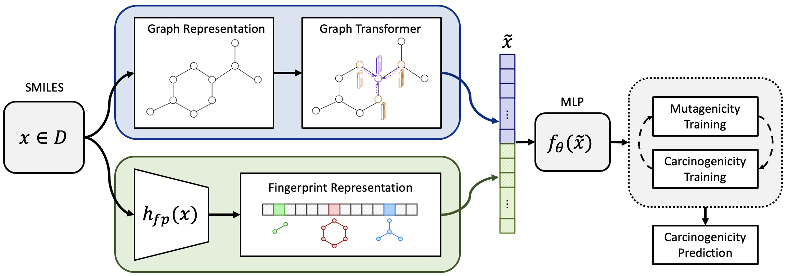

## A Graph Neural Network Approach to MoleculeCarcinogenicity Prediction




### Abstract:

`
Molecular carcinogenicity is a preventable cause of cancer, however, most experimentaltesting of molecular compounds is an expensive and time consuming process, making highthroughput experimental approaches infeasible. In recent years, there has been substantialprogress in adopting machine learning as an appealing alternative forin vivoprediction ofmolecule carcinogenicity. In this work, we propose a new system, CONCERTO, which usesa graph transformer in conjunction with a molecular fingerprint representation, trained onmulti-round mutagenicity and carcinogenicity objectives. To train and validate CONCERTO,we augment the training dataset with more informative labels and utilize a larger externalvalidation dataset. Extensive experiments demonstrate that our model yields results superiorto alternate approaches for molecular carcinogenicity prediction.
`

### Reproduce:

#### Code

To train CONCERTO:

First you need to download the GROVER repo from https://github.com/adamoyoung/grover and download the model files as indicated under Pretained Model Download header. Then you should be able to train the model with the hyperparameters described below.  

```
train.py --atom_pairs_fingerprints=false --batch_size=512 --carc_percentile_to_drop=1 --cross_validation=true --ff_dropout=0.1 --ff_hidden_feats=64 --ff_num_layers=5 --fp_nbits=2048 --gradient_clip_norm=10000 --grover_fp=large --lr=0.00044800187354224327 --lr_decay_factor=0.5 --min_carbon_count=3 --model_type=mlp_fingerprint --mut_pre_training=true --network_weight_decay=0.01 --num_mut_pre_training_loop=2 --patience=20 --torsion_fingerprints=false 
```

To conduct counterfactual analysis:

```
genetic_explain.py 1svdygk7 --wandb_mode online --lower_bound_percent 0 --upper_bound_percent 100 --delta 0.5 --num_generations 1 --num_mols_to_explain 1000 --num_viz 150 --num_samples 3000 --explain_name lots_of_mols
```

#### Model Files

Model files and data results are located in: `./CONCERTO_model_and_results/`


#### To load model
```
config_fn = "config_0.json"
with open(os.path.join(new_run_dp, config_fn),'r') as config_file:
	args = json.load(config_file)
args["device"] = dev
train_loader, val_loader, test_loader, held_out_test_data_loader, data_feats = load_data(args)

model = get_model(args,data_feats)

model.to(dev)
checkpoint = th.load(os.path.join(new_run_dp,checkpoint_fn),map_location=dev)
model.load_state_dict(checkpoint)

```